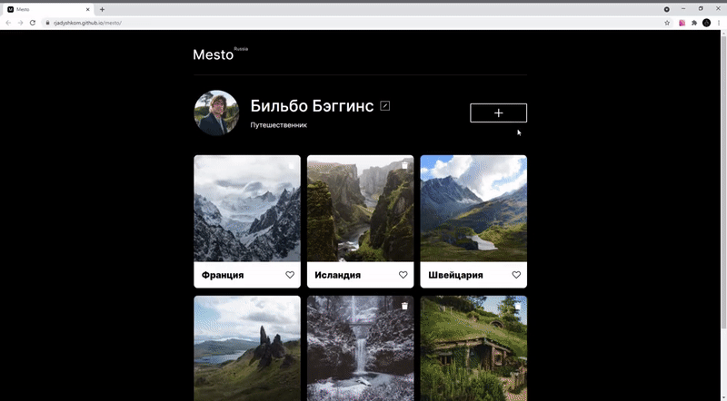

# 🤘 Mesto

**Проект Mesto, это интерактивная страница, куда можно добавлять фотографии, удалять их и ставить лайки**



## 🔔 Что сделано:

* Структура проекта BEM Nested
* Работа с макетом (Figma)
* Вёрстка секций (HTML + CSS)
* Адаптивная вёрстка секций (CSS)
* Работа со шрифтами (CSS)
* Оформление ссылок (CSS)
* Оформление кнопок (CSS)
* Получение и подстановка значений (JavaScript)
* Изменение содержимого страницы (JavaScript)
* Работа со слушателями событий (JavaScript)
* Валидация форм (JavaScript)  
* ООП рефакторинг (JavaScript)
* Модульный JavaScript  
* Сборка проекта (Webpack)
* Минификация (Webpack)
* Кроссбраузерность (Webpack)

## 💻 Команды:

*Для сборки проекта в режиме разработки*

```bash
🚩 npm run build

```

*Для автоматической публикации собранного проекта на GitHub*

```bash
🚩 npm run deploy

```

*Для сборки и автозапуска на локальном сервере*

```bash
🚩 npm run dev
```

[Ссылка на опубликованный сайт 🚀](https://rjadyshkom.github.io/mesto)